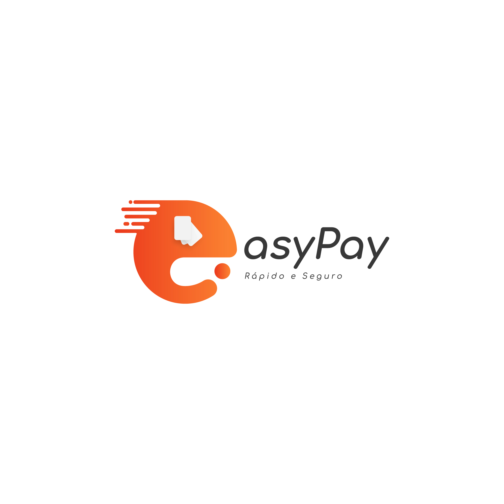
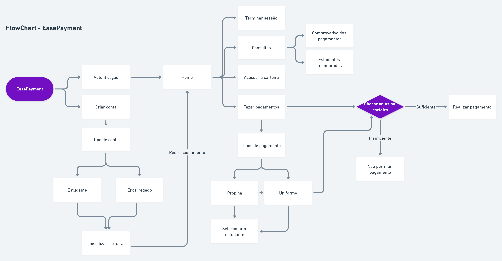
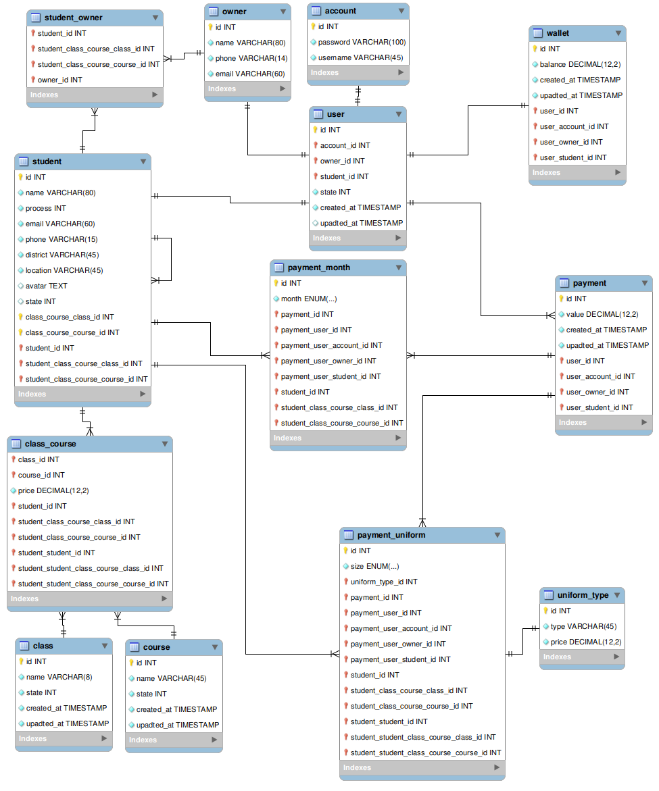

# EasePayment

Easepayment é uma aplicação escolar voltaga para pagamento de serviços prestados pela instituição desde propínas, confirmações, materiais escolar etc.

Para além destes serviços ele também permite ter um controlo do estudante acompanhando assim o estrato dos pagamentos realizados para determinados educandos.

**Objectivos Gerais**
Fazer com que para além das actividades bases a aplicação possa ser incorporada a bancos fazendo com que os pagamentos sejam referenciados directamente para a instituição sem a necessidade de ser levado um comprovativo de forma presencial para fazer apresentação.

Permitir pagamento e emição de boletim de notas, declarações com e sem notas, para tal fariamos uma conexão com um gestor escolar de modo que os mesmos dados sejam providos pelo gestor.

E ainda como objectivos gerais a plataforma poderá ter:

- Possibilidade em receber empréstimos para poder pagar a instituição, e o empréstimo será a instituição a fazê-lo.
- Associar filhos a conta de responsável.
- Poder associar a conta do easepayment as contas bancárias de diversos bancos.
- Verificar o histórico e aproveitamento do estudante.
- Ser notificado de todas as actividades realizadas pela instituição com antesedência, por meio de mensagem escrita e não só.
- Para além de associar as suas contas bancárias possuir uma carteira digital.
- Possibilidade em pagar tudo e mais alguma coisa que a instituição oferece como por exemplo (uniforme, propina, actividades escolares, materiais escolares).
- Gerar uma referência de pagamento e factura de pagamento que em seguida será encaminhada para a instituição.
- Notificação de atraso de pagamento.

**Objectivos específicos**

De forma específica face ao MVP inicial da aplicação.

As actividades em alta será:

- Criação de conta responsável.
- Associar a conta aos educandos que monitora ou a sí mesmo caso for responsável de sí mesmo.
- Realização de pagamento de propína, uniforme.
- Carteira onde será descontando os valores.
- Possibilidade de carregar e diminuir o valor da carteira.
- Realizar pagamento de forma direcionada, para um ou vários educandos que se encontrarm associados a conta pai.
- Gerar uma referência de pagamento e factura de pagamento que em seguida será encaminhada para a instituição.

## Flow chart da aplicação

No Flow chart a baixo conseguimos constactar as funcionalidades iniciais da aplicação.

Os pontos pendentes da aplicação em questão.

## Diagrama da base de dados

## License

Copyright (c) 2021 **António Campos Gabriel**